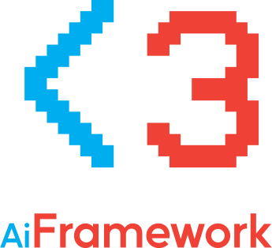

<p align="center">
  
</p>

# AiFramework

Yet another game framework, being my third attempt at making one.

# Test Application

The test application was moved to a separate repository for organizational reasons, which can be found here: https://github.com/r0neko/AiFrameworkTestApp

# Requirements - Windows(vcpkg)

You are an Windows user? We gotchu! Install these requirements and then the code will magically work!

```
vcpkg install glad[wgl]:x86-windows-static-md opengl:x86-windows-static-md glm:x86-windows-static-md glad[wgl]:x64-windows-static-md opengl:x64-windows-static-md glm:x64-windows-static-md
```

Don't forget to use Visual Studio for this to work! (in the future you'll be able to use CMake too, or maybe you can ditch Visual Studio altogether)

# Requirements - Linux

You are a Linux gamer? No problem! To compile AiFramework, just run our professional grade building script like this...

```
./build.sh
```

and it will take care of installing the required packages and building everything automatically!
After running the building script, you can just `make` and it will build `libaifw.so` under the `build` directory, which can be later used in your apps.

**IMPORTANT NOTE:** Building AiFramework with an earlier version of GCC will fail! Make sure you have GCC 9 or newer and check whether the C++20 standard is supported.
This may occur to you when compiling AiFramework on a standard installation of Raspbian. Upgrade to a newer version of GCC to solve this. A script is provided in the AiFramework directory for this purpose, called `gcc_update_rpi.sh`

# Requirements - MacOS

Well, we didn't get that far. If you want to take your shot at making this a reality, make a fork, do your magic, then make a pull request.

# Requirements - Android

Actually, it's currently work-in-progress. Slowly moving to the CMake build system to make this happen. Also, it will use the Android NDK to build the library and you will need to implement a small JNI interface for your app.

# Documentation

You may be wondering... where is the documentation?
I will write some documentation once everything is stable enough. Until then, you can perhaps try to refer to the provided test application.
